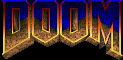
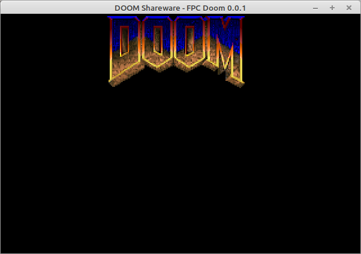
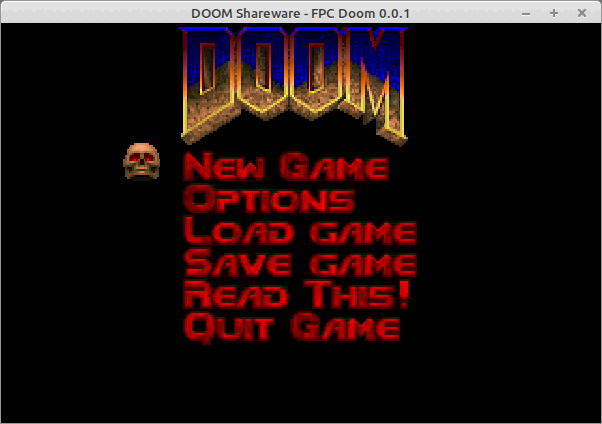
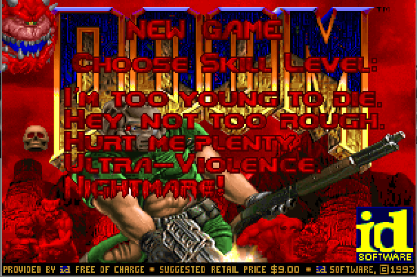
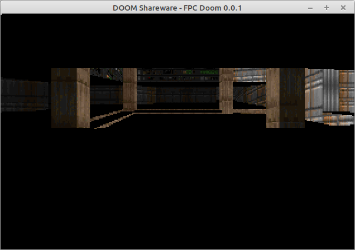
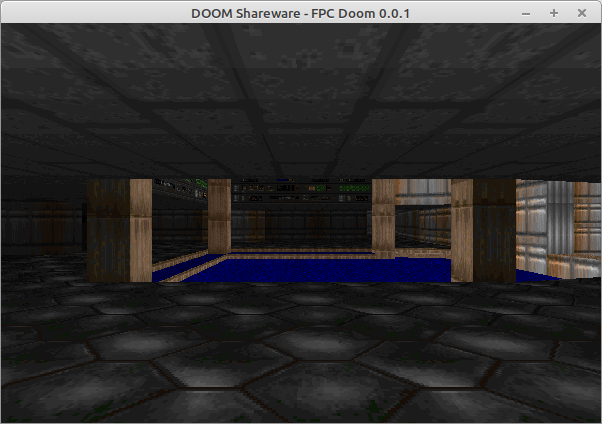
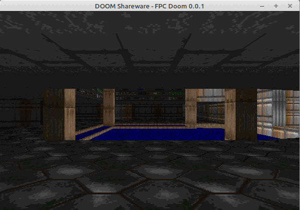
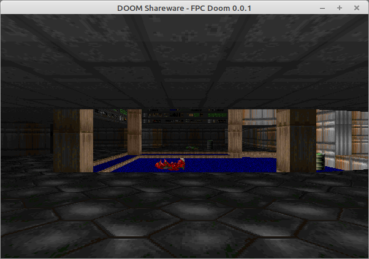

# FPC DOOM

In this repository i try to port DOOM to Free-Pascal using OpenGL and therefore beeing platform indipendant.

> !! Attention !!
> 
> This is a work in Progress, don't expect anything to work (yet)..

The original code was released by [id-Software](https://github.com/id-Software/DOOM) unfortunatunelly 
i was not able to get the code running so i decided to use the 
[crispy-doom](https://github.com/fabiangreffrath/crispy-doom) version as base (as this one directly compiled 
and was able to start and play the .wad files i have had laying around).

Also i found some usefull documentations that try to explain the code:
- https://fabiensanglard.net/doomIphone/doomClassicRenderer.php
- https://doomwiki.org/wiki/Doom_source_code
- https://doom.fandom.com/wiki/Doom_source_code
- https://doom.fandom.com/wiki/Doom_source_code_files
  
There is already a [FPC Doom](https://github.com/jval1972/FPCDoom) on the [List](https://doomwiki.org/wiki/Source_port) of 
ports, but that version only supports DirectX and therefore only supports Windows platform.

## What needs to be done to compile the code
- install [Lazarus-IDE](https://www.lazarus-ide.org/)
- install package LazOpenGLContext (is shipped with lazarus)
- download [dglOpenGL.pas](https://github.com/saschawillems/dglopengl) and store it in the units folder

## What needs to be done to play the game
- get a valid .wad file and copy it where the binary is beeing created (or use this [shareware](https://www.doomworld.com/3ddownloads/ports/shareware_doom_iwad.zip) version)
- wait until this repository has have enough progress to be a playable game (see section [progress](#progress))
- start the application

## progress:
<!-- 
Homepage used to create .gif images: https://ezgif.com/maker
-->
- got crispy-doom compiled
- created initial FPC_DOOM Lazarus project
- (2025.01.03) stored everything on Github
- able to extract icon from doom_icon.pas
- w_wad.pas can now "load" the .wad file
- (2025.01.09) able to store "patches" when drawn as .bmp files to harddisc, very first extracted image "M_DOOM" 
- (2025.01.10) activate OpenGL Rendering default upscale = 2 
- (2025.01.12) integrate keyboard event loop and main menu with quit button 
- (2025.01.13) finish part of menues necessary to actually start a game 
- (2025.01.20) finish wipe function 
- (2025.01.22) able to create very first screenrendering    still missing flats..
- (2025.01.23) finally was able to enable flats 
- (2025.01.24) add ability to rotate player, lets take a shy look around ;) 
- (2025.01.25) enable sprite rendering 
  